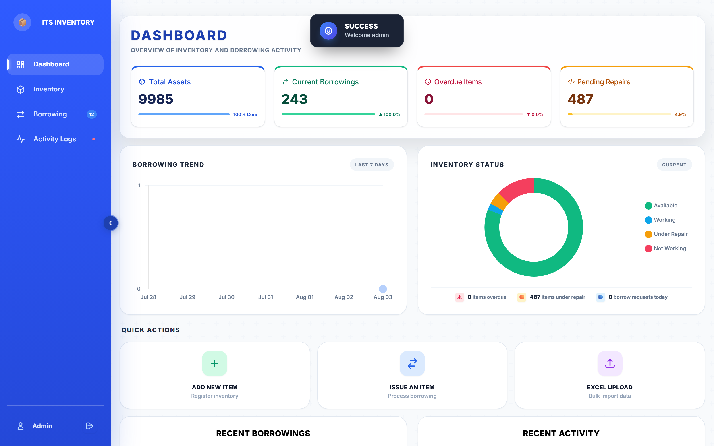
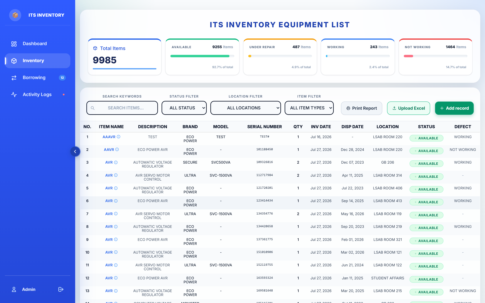
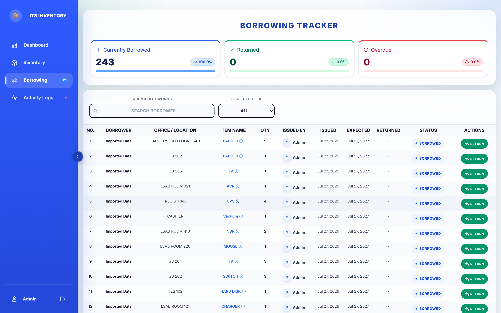
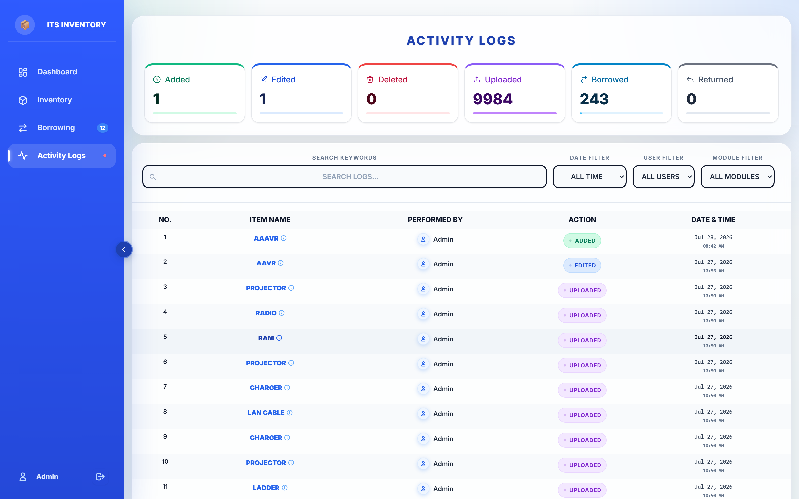

# Accomplishment Report - Web Application Snapshots

---

### **4. Developed the Inventory Management System for recording and monitoring office assets and supplies.**

#### **Description & System Overview**
Designed, developed, and deployed the central **Inventory Management System (ITS Inventory)** to streamline office asset tracking, hardware lifecycle management, equipment monitoring, and office supply distribution. The platform replaces manual record-keeping with real-time tracking, automated audit logging, interactive analytics, and multi-location asset assignment.

#### **Key Features & Capabilities**
- **Real-Time Monitoring Dashboard**: Interactive KPIs displaying total registered assets (9,985+ items), active borrowings, pending repairs, and real-time asset health status distribution.
- **Asset & Supply Recording**: Centralized repository for recording item types, brands, models, serial numbers, quantities, acquisition dates, disposal dates, defects, and storage locations.
- **Issuance & Borrowing Lifecycle**: Tracks office equipment and supplies lent out to staff/departments with borrower details, due dates, issue dates, and return statuses.
- **Advanced Search & Filtering**: Multi-criteria filters by status (`Available`, `In Use`, `Under Repair`, `Not Working`), location, and item category with instant query execution.

#### **Visual Evidence & Snapshots**

##### **Figure 4.1: Inventory Management Dashboard & Analytics**

##### **Figure 4.2: Asset & Supply Recording & Tracking Management**

##### **Figure 4.3: Office Asset & Equipment Borrowing Monitoring**

---

### **9. Prepared system-generated inventory reports.**

#### **Description & System Overview**
Engineered automated reporting modules within the Inventory Management System to produce accurate, real-time, system-generated administrative and audit reports. These reports enable management to monitor equipment utilization, track historical changes, audit asset maintenance, and verify office supply allocation.

#### **Key Features & Capabilities**
- **Automated Audit & Activity Logs**: System-generated history logging every action (item creation, edit, deletion, borrowing, return, and batch import) with timestamps and user details.
- **Filterable Status & Category Reports**: Instant report generation filtering by item status, location, category, date range, or borrower.
- **Batch Excel / CSV Import & Export Capabilities**: Built-in system report tools for exporting inventory metrics and importing bulk asset registries.

#### **Visual Evidence & Snapshots**

##### **Figure 9.1: System-Generated Activity & Audit Log Report**

##### **Figure 9.2: System-Generated Inventory Status & Category Summary Report**

---
