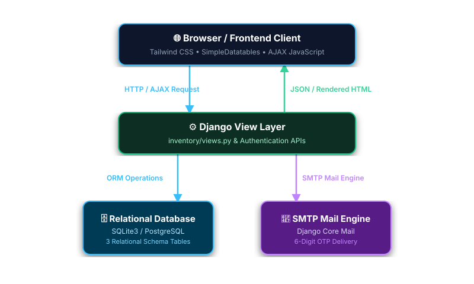
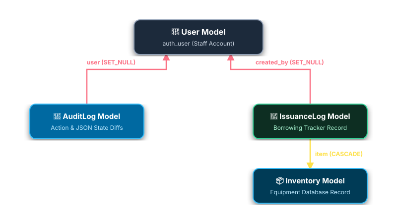

# 🏗️ Technical Architecture & System Design

> Deep-dive technical architectural document detailing data models, ORM relationships, OTP state machine, field-level diff engine, and API structures for the **ITS Inventory Management System**.

---

## 📋 Table of Contents

- [System Architecture Overview](#-system-architecture-overview)
- [Data Models & Schema Reference](#-data-models--schema-reference)
  - [1. Inventory Model](#1-inventory-model)
  - [2. IssuanceLog (Borrowing) Model](#2-issuancelog-borrowing-model)
  - [3. AuditLog Model](#3-auditlog-model)
- [ORM Relationships & Cascade Rules](#-orm-relationships--cascade-rules)
- [Email OTP Authentication State Machine](#-email-otp-authentication-state-machine)
- [Field-Level Snapshot Diff Engine](#-field-level-snapshot-diff-engine)
- [AJAX Request / Response Specification](#-ajax-request--response-specification)

---

## 🏗️ System Architecture Overview

The system is structured as a full-stack Django 5.2 application following the Model-View-Template (MVT) architecture with RESTful JSON endpoints for asynchronous UI interactions:


> ✏️ **Draw.io Source File:** [`docs/mvt_architecture.drawio`](docs/mvt_architecture.drawio) *(Editable in [Draw.io / app.diagrams.net](https://app.diagrams.net/))*

---

## 🗄️ Data Models & Schema Reference

The core application consists of three primary database models defined in `inventory/models.py`:

### 1. Inventory Model

Stores equipment hardware records, availability counts, serial numbers, and locations.

| Field Name | Django Field Type | Constraints & Options | Description |
|---|---|---|---|
| `id` | `BigAutoField` | Primary Key, Auto-increment | Unique internal inventory ID |
| `item_name` | `CharField(max_length=200)` | Required, Indexed | Name / Model of equipment |
| `category` | `CharField(max_length=50)` | Choices: `Desktop`, `Laptop`, `Monitor`, `Printer`, `Networking`, `Peripheral`, `Component`, `Other` | Hardware classification category |
| `serial_number` | `CharField(max_length=100)` | Unique, Indexed | Manufacturer serial number |
| `asset_tag` | `CharField(max_length=100)` | Unique, Blank/Null | Institutional asset tag identifier |
| `location` | `CharField(max_length=150)` | Required | Physical office, room, or lab location |
| `status` | `CharField(max_length=20)` | Choices: `available`, `in_use`, `repair`, `disposed`, `lost` | Current operational state |
| `quantity` | `PositiveIntegerField` | Default: 1 | Total inventory quantity owned |
| `available_quantity` | `PositiveIntegerField` | Default: 1 | Quantity available for borrowing |
| `date_acquired` | `DateField` | Null/Blank allowed | Equipment acquisition date |
| `created_at` | `DateTimeField` | `auto_now_add=True` | Timestamp when record was created |
| `updated_at` | `DateTimeField` | `auto_now=True` | Timestamp of last modification |

---

### 2. IssuanceLog (Borrowing) Model

Tracks equipment loans, borrower details, quantities, expected return dates, and overdue status.

| Field Name | Django Field Type | Constraints & Options | Description |
|---|---|---|---|
| `id` | `BigAutoField` | Primary Key, Auto-increment | Unique borrowing log ID |
| `item` | `ForeignKey(Inventory)` | `on_delete=models.CASCADE` | Relational reference to borrowed item |
| `borrower_name` | `CharField(max_length=150)` | Required | Full name of the borrower |
| `borrower_department` | `CharField(max_length=150)` | Required | Office or department of borrower |
| `borrower_email` | `EmailField()` | Required | Contact email for return notices |
| `quantity_borrowed` | `PositiveIntegerField` | Default: 1 | Number of items issued |
| `issue_date` | `DateField` | `auto_now_add=True` | Date equipment was issued |
| `expected_return_date` | `DateField` | Required | Expected return deadline |
| `actual_return_date` | `DateField` | Null/Blank | Date item was actually returned |
| `status` | `CharField(max_length=20)` | Choices: `borrowed`, `returned`, `overdue` | Loan lifecycle state |
| `notes` | `TextField` | Blank allowed | Remarks or condition notes |
| `created_by` | `ForeignKey(User)` | `on_delete=models.SET_NULL`, Null | Staff user who issued the equipment |

---

### 3. AuditLog Model

Maintains an immutable system-wide audit trail for all CRUD operations, equipment loans, and returns.

| Field Name | Django Field Type | Constraints & Options | Description |
|---|---|---|---|
| `id` | `BigAutoField` | Primary Key, Auto-increment | Unique audit log ID |
| `user` | `ForeignKey(User)` | `on_delete=models.SET_NULL`, Null | User who performed the action |
| `action` | `CharField(max_length=20)` | Choices: `CREATE`, `UPDATE`, `DELETE`, `ISSUE`, `RETURN` | Type of audit action |
| `item_name` | `CharField(max_length=200)` | Required | Name of the affected item |
| `details` | `TextField()` | JSON formatted string | Structured snapshot of changed fields |
| `timestamp` | `DateTimeField` | `auto_now_add=True` | Exact timestamp of the event |

---

## 🔗 ORM Relationships & Cascade Rules


> ✏️ **Draw.io Source File:** [`docs/orm_relationships.drawio`](docs/orm_relationships.drawio) *(Editable in [Draw.io / app.diagrams.net](https://app.diagrams.net/))*

- **`IssuanceLog` -> `Inventory` (`CASCADE`)**: Deleting an inventory item cascades to delete its historical loan logs.
- **`IssuanceLog` -> `User` (`SET_NULL`)**: Deleting a staff user sets `created_by` to `NULL` while preserving the borrowing record for accountability.
- **`AuditLog` -> `User` (`SET_NULL`)**: Preserves audit history even if a user account is removed.

---

## 🔐 Email OTP Authentication State Machine

The registration and password recovery flows use a session-based state machine:

```
[ Unauthenticated Client ] ──POST /api/send-otp/──► Validate Availability ──► Generate 6-Digit OTP
                                                                                   │
                                                                           Store Code & Timestamp
                                                                           in Django Session (120s)
                                                                                   │
                                                                                   ▼
[ User Submits OTP ] ◄──POST /api/verify-otp/─── Verify Expiration (<120s) ◄── Send SMTP Email
         │
    Matches Code?
   ┌─────┴─────┐
   ▼           ▼
[ VALID ]   [ INVALID / EXPIRED ]
   │           │
Create User   Return 400 JSON Error
Log Session
```

Key Logic:
1. **6-Digit Cryptographic Code**: Generated via `random.randint(100000, 999999)`.
2. **120s Expiration Window**: Timestamp verified against `timezone.now().timestamp()`.
3. **Case-Insensitive Recovery**: Queries user accounts via `User.objects.filter(email__iexact=email)`.

---

## 📝 Field-Level Snapshot Diff Engine

When an existing inventory record is updated, the view computes field-level differences before committing:

```python
# Sample snapshot generation logic in inventory/views.py
diffs = {}
for field in ['item_name', 'category', 'location', 'status', 'quantity']:
    old_val = getattr(old_instance, field)
    new_val = form.cleaned_data.get(field)
    if str(old_val) != str(new_val):
        diffs[field] = {'old': str(old_val), 'new': str(new_val)}

AuditLog.objects.create(
    user=request.user,
    action='UPDATE',
    item_name=instance.item_name,
    details=json.dumps(diffs)
)
```

The resulting JSON string is stored in `AuditLog.details` and parsed dynamically by `static/js/activity_log.js` to render expandable side-by-side diff modals:

```json
{
  "status": {"old": "available", "new": "repair"},
  "location": {"old": "Lab 101", "new": "ITS Maintenance Room"}
}
```

---

## ⚡ AJAX Request / Response Specification

All asynchronous operations return standardized JSON responses:

### Success Response Format (`200 OK`)
```json
{
  "success": true,
  "message": "Inventory record updated successfully.",
  "data": {
    "id": 42,
    "item_name": "Dell OptiPlex 7090",
    "status": "available"
  }
}
```

### Error Response Format (`400 Bad Request` / `500 Server Error`)
```json
{
  "success": false,
  "message": "Invalid OTP code provided or code has expired.",
  "errors": {
    "otp": ["The 6-digit code entered is incorrect."]
  }
}
```
