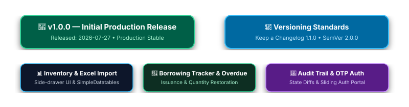

# 📜 Changelog

All notable changes to the **ITS Inventory Management System** will be documented in this file.

The format is based on [Keep a Changelog](https://keepachangelog.com/en/1.1.0/), and this project adheres to [Semantic Versioning](https://semver.org/spec/v2.0.0.html).

---

## [1.0.0] - 2026-07-27

> ✏️ **Draw.io Source File:** [`docs/changelog_timeline.drawio`](docs/changelog_timeline.drawio) *(Editable in [Draw.io / app.diagrams.net](https://app.diagrams.net/))*

### 🚀 Initial Production Release

#### 📊 Inventory Management
- **Full CRUD Operations**: Create, read, update, and delete inventory records via a responsive side-drawer UI.
- **Advanced Filtering**: Filter items by status (`Available`, `In Use`, `Under Repair`, `Disposed`, `Lost`), location, and item type with a persistent search bar.
- **Bulk Excel Import**: Import equipment records in bulk from `.xlsx` and `.csv` spreadsheets powered by `openpyxl` and `pandas`.
- **Sortable Datatables**: Paginated, sortable inventory datatable engine via `SimpleDatatables 9.0.3`.

#### 🔄 Borrowing Tracker
- **Equipment Issuance**: Issue available items to borrowers with office/location details, requested quantity, and expected return dates.
- **Return Processing**: One-click return confirmation with automatic inventory quantity restoration.
- **Overdue Detection**: Automatic status escalation when items pass their expected return date.
- **Statistics Dashboard**: Real-time metrics cards tracking Total Issuances, Returned Items, and Overdue Loans.

#### 📝 Activity Log & Audit Trail
- **Comprehensive Audit Trail**: Every create, edit, delete, borrow, and return action is logged automatically.
- **Field-Level State Diffs**: Edit actions store field-level snapshots showing exact before and after values.
- **User Attribution**: Each log entry records the specific user who performed the action.
- **Side-by-Side Diff Modal**: Clickable log entries that display detailed, side-by-side diff views.

#### 🔐 Security & Authentication Portal
- **Single-Card Sliding Portal**: Dual-panel auth container with smooth horizontal slide animation between Login, Signup, and Password Recovery states.
- **Email & OTP Account Signup**: Asynchronous 6-digit OTP verification with a strict 120-second expiration sent via Django Core Mail.
- **Self-Service Password Reset**: Case-insensitive email lookup (`email__iexact`), 6-digit recovery OTP verification, and secure password update flow.
- **Centered System Overlay Modals**: Popup modals (`#errorModalOverlay` and `#successModalOverlay`) for clean alert feedback.

#### 📄 Open Source & Community Standards
- Integrated **Draw.io Vector Architecture Diagrams** (`architecture.drawio.svg` & `borrowing_lifecycle.drawio.svg`).
- Created native GitHub community standard files: `SECURITY.md`, `CONTRIBUTING.md`, `CODE_OF_CONDUCT.md`, `CITATION.cff`, `SUPPORT.md`, and `CHANGELOG.md`.
