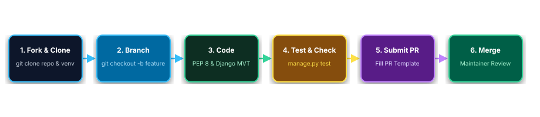

# 🤝 Contributing Guidelines

Thank you for your interest in contributing to the **ITS Inventory Management System**! This document provides guidelines and best practices for submitting bug fixes, new features, and documentation improvements.

---

## 📋 Table of Contents

- [Code of Conduct](#-code-of-conduct)
- [Getting Started](#-getting-started)
- [Development Workflow](#-development-workflow)
- [Coding Standards](#-coding-standards)
- [Submitting Pull Requests](#-submitting-pull-requests)

---

## 📜 Code of Conduct

We are committed to providing a welcoming, respectful, and collaborative environment for everyone. Please ensure all interactions across issues, pull requests, and discussions remain professional and constructive.

---

## 🚀 Getting Started

### Prerequisites
- **Python 3.13+**
- **Git**
- **pip**

### Local Development Setup

1. **Fork & Clone the Repository**:
   ```powershell
   git clone https://github.com/TheUnshackled1/ITS-INVENTORY-SYSTEM.git
   cd ITS-INVENTORY-SYSTEM
   ```

2. **Create & Activate Virtual Environment**:
   ```powershell
   python -m venv env
   .\env\Scripts\Activate
   ```

3. **Install Dependencies**:
   ```powershell
   pip install -r requirements.txt
   ```

4. **Apply Migrations**:
   ```powershell
   python manage.py migrate
   ```

5. **Run the Test Suite**:
   ```powershell
   python manage.py test
   ```

6. **Start the Server**:
   ```powershell
   python manage.py runserver
   ```

---

## 🔄 Development Workflow


> ✏️ **Draw.io Source File:** [`docs/contribution_workflow.drawio`](docs/contribution_workflow.drawio) *(Editable in [Draw.io / app.diagrams.net](https://app.diagrams.net/))*

1. **Create a Feature Branch**:
   ```powershell
   git checkout -b feature/your-feature-name
   # or for bug fixes:
   git checkout -b fix/issue-description
   ```

2. **Make Your Changes**: Keep commits focused, modular, and easy to review.

3. **Run Automated Tests**:
   Ensure all unit tests pass cleanly before committing:
   ```powershell
   python manage.py test
   python manage.py check
   ```

---

## 📐 Coding Standards

- **Python**: Follow [PEP 8](https://peps.python.org/pep-0008/) style conventions. Write clean Django views with strict control flow and error handling.
- **HTML / Templates**: Use standard Django template inheritance and keep interactive elements accessible with descriptive IDs.
- **CSRF Safety**: Always include `` inside POST forms.
- **Frontend / Styling**: Utilize Tailwind CSS classes and existing glassmorphic design system tokens. Avoid inline hardcoded style overrides where possible.

---

## 📤 Submitting Pull Requests

1. Push your feature branch to your fork:
   ```powershell
   git push origin feature/your-feature-name
   ```
2. Open a **Pull Request (PR)** against the `main` branch of the official repository.
3. Provide a clear title and description explaining what your PR changes or fixes.
4. Ensure all automated tests (`manage.py test`) pass OK on your branch.

Thank you for contributing to the MIS & ICT equipment management platform!
