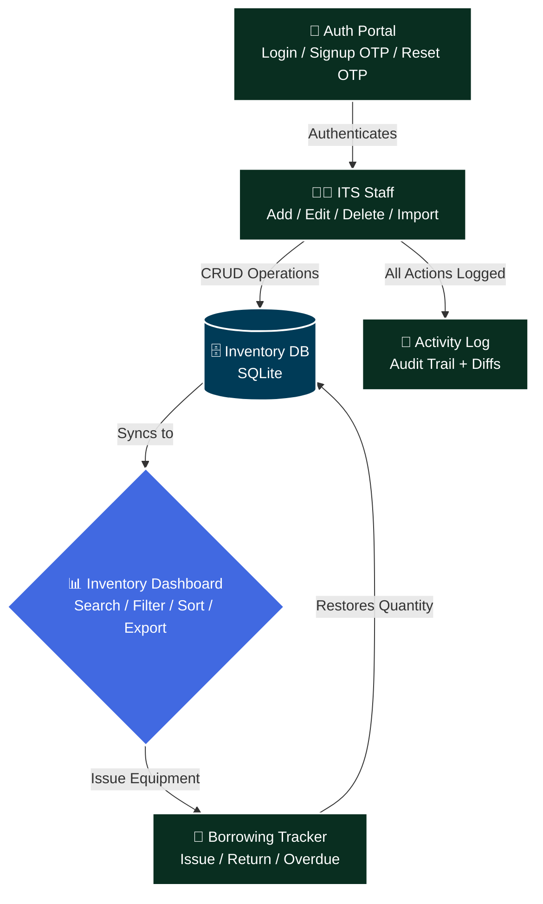

# 📦 ITS Inventory Management System

> **A web-based inventory management system built with Django for the Information and Communications Technology (ICT) department & Management Information Systems (MIS) department. Designed for internal tracking of IT assets, audit logs, email OTP user registration, self-service password recovery, and bulk Excel uploads.**

🌐 **Live Demo:** [itsinventory.pythonanywhere.com](http://itsinventory.pythonanywhere.com/)


---

## 📋 Table of Contents

- [Overview](#-overview)
- [Objectives](#-objectives)
- [Core Features](#-core-features)
- [System Architecture](#-system-architecture)
- [Tech Stack](#-tech-stack)
- [Setup & Installation](#-setup--installation)
- [Usage](#-usage)
- [URL & API Endpoints](#-url--api-endpoints)
- [Configuration & Security](#-configuration--security)
- [Project Structure](#-project-structure)
- [About](#-about)
- [License](#-license)

---

## 🔍 Overview

Managing IT equipment across multiple offices and laboratories with spreadsheets is slow, error-prone, and difficult to audit. The **ITS Inventory Management System** is a full-stack Django web application that digitizes the entire equipment lifecycle for the ITS Department.

The system provides four core workflows:

1. **Inventory Management** — Add, edit, delete, search, filter, and bulk-import IT equipment records with full CRUD operations.
2. **Borrowing & Returns** — Issue equipment to borrowers with expected return dates, track overdue items, and process returns — all with a complete paper trail.
3. **Activity Logging** — Every create, edit, delete, borrow, and return action is automatically logged with before/after snapshots for full auditability.
4. **Security & Self-Service Authentication** — Email OTP verification for account signup and self-service password recovery with case-insensitive user lookup and centered overlay alert modals.

The result: a centralized, transparent, and accountable inventory system with a premium, modern UI.

---

## 🎯 Objectives

| Goal | Description |
|---|---|
| 📁 **Centralize Records** | Replace spreadsheet-based tracking with a unified digital inventory system |
| 🔄 **Streamline Borrowing** | Track equipment issuance, expected returns, and overdue items in real time |
| 🧾 **Ensure Accountability** | Log every action with user attribution and before/after state diffs |
| 🔑 **Secure Authentication** | Email & OTP verification for account registration and password recovery |
| 📤 **Bulk Import** | Support `.xlsx` and `.csv` uploads for rapid data migration from existing spreadsheets |
| 🎨 **Premium UI/UX** | Deliver a polished, modern interface with Tailwind CSS, glassmorphism, overlay modals, and micro-animations |

---

## ✨ Core Features

### 📊 Inventory Dashboard
- **Full CRUD** — Add, view, edit, and delete inventory records via a sleek side-drawer UI
- **Advanced Filtering** — Filter by status, location, and item type with a persistent search bar
- **Bulk Excel Import** — Upload `.xlsx` or `.csv` files to import hundreds of records at once
- **Status Tracking** — Visual status badges: Available, In Use, Under Repair, Disposed, Lost
- **Sortable DataTable** — Paginated, sortable table powered by SimpleDatatables

### 🔄 Borrowing Tracker
- **Equipment Issuance** — Issue items to borrowers with office/location, quantity, and expected return date
- **Return Processing** — One-click return confirmation with automatic quantity restoration
- **Overdue Detection** — Automatic status escalation when items pass their expected return date
- **Statistics Cards** — At-a-glance metrics: Total Issuances, Returned, Overdue
- **Tab Filtering** — Quick-switch between All, Borrowed, Returned, and Overdue views

### 📝 Activity Log
- **Full Audit Trail** — Every create, edit, delete, borrow, and return action is recorded
- **Before/After Diffs** — Edit actions store field-level snapshots showing exactly what changed
- **User Attribution** — Each log entry records which user performed the action
- **Detail Modal** — Click any log entry for an expanded, side-by-side diff view

### 🔐 Security & Authentication Portal
- **Single-Card Sliding Portal** — Modern dual-panel auth container with smooth horizontal slide animation between Login, Signup, and Password Recovery states.
- **Email & OTP Account Signup** — Asynchronous 6-digit OTP verification code with a 120-second lifespan sent directly to the user's email before account creation.
- **Self-Service Password Reset** — Case-insensitive email lookup (`email__iexact`), 6-digit recovery OTP verification, and secure password update flow.
- **System Overlay Modals** — Centered system overlay popup modals (`#errorModalOverlay` and `#successModalOverlay`) for alerts and confirmations instead of traditional inline toasts.
- **Interactive UI Micro-Animations** — Animated left direction arrows (`← Nevermind, back to login`), field focus states, password visibility toggle eyes, and button spinner states.

---

## 🏗️ System Architecture

### Overall Flow



### Borrowing Lifecycle


---

## 🛠️ Tech Stack

| Layer | Technology |
|---|---|
| **Web Framework** | Django 5.2 |
| **Language** | Python 3.13+ |
| **Database** | SQLite 3 (default) / PostgreSQL (production) |
| **Frontend Styling** | Tailwind CSS (CDN) |
| **DataTables** | SimpleDatatables 9.0.3 |
| **Typography** | Google Fonts — Inter |
| **Excel Parsing** | openpyxl 3.1.5 |
| **Email Service** | Django Core Mail (SMTP) |
| **Icons** | Inline SVG (hand-crafted) |

---

## 🚀 Setup & Installation

> Detailed step-by-step guide for setting up the project on **Windows** with **Python 3.13+**.

### ✅ Prerequisites

| Tool | Minimum Version | Download |
|---|---|---|
| **Python** | 3.13 | https://www.python.org/downloads/ |
| **pip** | Latest | Bundled with Python |
| **Git** | Any | https://git-scm.com/download/win |

---

### 1. Clone the Repository

```powershell
git clone <repository-url>
cd system
```

Replace `<repository-url>` with the actual GitHub URL of this project.

---

### 2. Set Up a Virtual Environment

```powershell
# Create the virtual environment
python -m venv env

# Activate it (PowerShell)
.\env\Scripts\Activate
```

---

### 3. Install Dependencies

```powershell
pip install -r requirements.txt
```

This installs:
- **Django 5.2** (Web framework)
- **openpyxl 3.1.5** (Excel file parsing for bulk imports)
- **pandas 3.0.3, numpy 2.5.1, Pillow 12.3.0** (Data & Image processing)
- **django-admin-interface & django-colorfield** (Admin customization)
- **asgiref, sqlparse, et_xmlfile, tzdata** (Dependencies)

---

### 4. Run Migrations

```powershell
python manage.py migrate
```

---

### 5. Create a Superuser

```powershell
python manage.py createsuperuser
```

---

### 6. Start the Development Server

```powershell
python manage.py runserver
```

The application will be available at `http://127.0.0.1:8000/`.

---

## 🔗 URL & API Endpoints

| Endpoint | Method | Description |
|---|---|---|
| `/` | `GET` | Inventory list (main dashboard) |
| `/login/` | `GET/POST` | Login, Signup & Password Recovery Portal |
| `/logout/` | `POST` | Log out and redirect to login |
| `/inventory/add/` | `GET/POST` | Add a new inventory record |
| `/inventory/<pk>/edit/` | `GET/POST` | Edit an existing inventory record |
| `/inventory/<pk>/delete/` | `POST` | Delete an inventory record (AJAX) |
| `/upload/` | `GET/POST` | Bulk upload via Excel/CSV |
| `/borrowing/` | `GET` | Borrowing tracker dashboard |
| `/borrowing/issue/` | `POST` | Issue equipment to a borrower (AJAX) |
| `/borrowing/<pk>/return/` | `POST` | Mark an item as returned (AJAX) |
| `/activity-log/` | `GET` | Full audit trail |
| `/api/send-otp/` | `POST` | Send 6-digit registration OTP to email |
| `/api/verify-otp/` | `POST` | Verify registration OTP & create user |
| `/api/forgot-password/` | `POST` | Send recovery OTP (case-insensitive email lookup) |
| `/api/forgot-verify-otp/` | `POST` | Validate password recovery OTP |
| `/api/forgot-reset-password/` | `POST` | Save new user password |
| `/admin/` | `GET` | Django Admin panel |

---

## 🛡️ Configuration & Security

| Setting | Default | Recommendation |
|---|---|---|
| `DEBUG` | `True` | Set to `False` and configure `ALLOWED_HOSTS` |
| `SECRET_KEY` | Hardcoded | Rotate and load from environment variable |
| `DATABASES` | SQLite | Consider PostgreSQL for production workloads |
| `OTP Expiration` | 120s | Configured 2-minute expiration for all email OTPs |
| `Email Lookup` | `email__iexact` | Case-insensitive email query for secure recovery |

---

## 📁 Project Structure

```
📦 system/
├── 📂 its_inventory/              ⚙️ Django project: settings, urls, wsgi, asgi
│   ├── 🐍 settings.py             # Project configuration (DB, middleware, email, etc.)
│   ├── 🐍 urls.py                 # Root URL routing & API mapping
│   ├── 🐍 wsgi.py                 # WSGI entry point
│   └── 🐍 asgi.py                 # ASGI entry point
├── 📂 inventory/                  ⚙️ Main app: models, views, forms, admin
│   ├── 🐍 models.py               # Inventory, IssuanceLog, AuditLog models
│   ├── 🐍 views.py                # All CRUD, borrowing, audit log, and OTP/Auth API logic
│   ├── 🐍 forms.py                # Django ModelForms for inventory
│   └── 🐍 admin.py                # Django Admin registration
├── 📂 templates/                  🎨 HTML templates
│   ├── 🌐 login.html              # Login, Signup, Reset Password & Overlay Modals
│   ├── 🌐 inventory.html          # Main inventory dashboard
│   ├── 🌐 borrowing.html          # Borrowing tracker
│   ├── 🌐 activity_log.html       # Audit log viewer
│   └── 🌐 inventory_upload.html   # Excel/CSV upload page
├── 📂 static/                     🎨 Static assets
│   ├── 📂 css/                    # Inventory, borrowing, login stylesheets
│   └── 📂 js/                     # Login slider/OTP/Modal handlers, inventory, tailwind config
├── 🗄️ db.sqlite3                  # SQLite database (auto-generated)
├── 🐍 manage.py                   # Django management CLI
├── ⚙️ requirements.txt            # Python dependencies
├── 📄 INSTRUCTIONS.md             # Detailed setup & security documentation
├── 📄 LICENSE                     # MIT License
└── 📄 README.md                   # System documentation
```

---

## 🧑‍💻 About

### The Project

The **ITS Inventory Management System** was originally developed as an internal tool for the **Information and Communications Technology (ICT) Department** and has been formally turned over to the **Management Information Systems (MIS) Department** for continued operation and maintenance. It replaces manual spreadsheet-based processes with a centralized, auditable, web-based platform.

### Turned Over To

This system was originally built for the ICT Department and has been handed over to the **Management Information Systems (MIS) Department** — ensuring continued, transparent, and fully auditable equipment management.

---

## 📄 License

This project is licensed under the **MIT License** — see the [LICENSE](LICENSE) file for full details.

```
MIT License

Copyright (c) 2026 John Tyrone Pagunsan Coronel (TheUnshackled1) — https://github.com/TheUnshackled1

Permission is hereby granted, free of charge, to any person obtaining a copy
of this software and associated documentation files (the "Software"), to deal
in the Software without restriction, including without limitation the rights
to use, copy, modify, merge, publish, distribute, sublicense, and/or sell
copies of the Software, and to permit persons to whom the Software is
furnished to do so, subject to the following conditions:

The above copyright notice and this permission notice shall be included in all
copies or substantial portions of the Software.

THE SOFTWARE IS PROVIDED "AS IS", WITHOUT WARRANTY OF ANY KIND, EXPRESS OR
IMPLIED, INCLUDING BUT NOT LIMITED TO THE WARRANTIES OF MERCHANTABILITY,
FITNESS FOR A PARTICULAR PURPOSE AND NONINFRINGEMENT.
```
