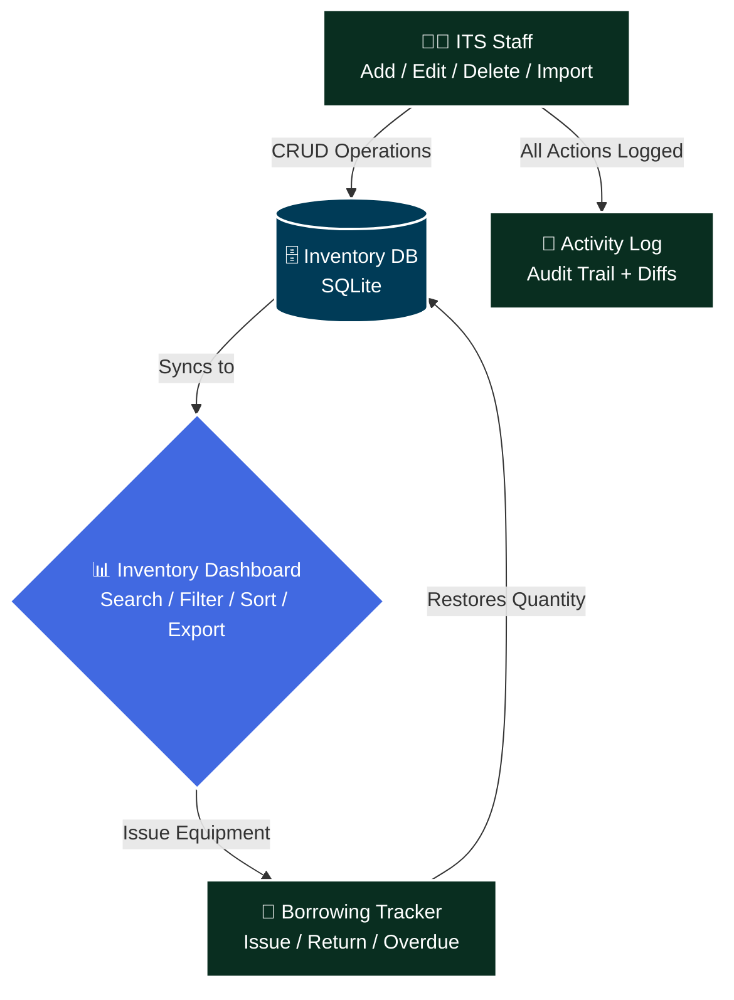
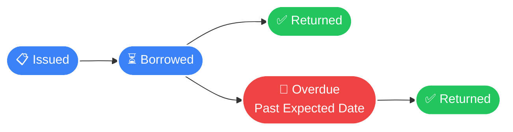

# 📦 ITS Inventory Management System

> **A web-based inventory management system built with Django for the Information Technology Services (ITS) department. Designed for internal tracking of IT assets, audit logs, and bulk Excel uploads.**

🌐 **Live Demo:** [itsinventory.pythonanywhere.com](http://itsinventory.pythonanywhere.com/)


---

## 📋 Table of Contents

- [Overview](#-overview)
- [Objectives](#-objectives)
- [Core Features](#-core-features)
- [System Architecture](#-system-architecture)
- [Tech Stack](#-tech-stack)
- [Setup & Installation](#-setup--installation)
- [Usage](#-usage)
- [URL Endpoints](#-url-endpoints)
- [Configuration & Security](#️-configuration--security)
- [Project Structure](#-project-structure)
- [About](#-about)
- [License](#-license)

---

## 🔍 Overview

Managing IT equipment across multiple offices and laboratories with spreadsheets is slow, error-prone, and difficult to audit. The **ITS Inventory Management System** is a full-stack Django web application that digitizes the entire equipment lifecycle for the ITS Department.

The system provides three core workflows:

1. **Inventory Management** — Add, edit, delete, search, filter, and bulk-import IT equipment records with full CRUD operations
2. **Borrowing & Returns** — Issue equipment to borrowers with expected return dates, track overdue items, and process returns — all with a complete paper trail
3. **Activity Logging** — Every create, edit, delete, borrow, and return action is automatically logged with before/after snapshots for full auditability

The result: a centralized, transparent, and accountable inventory system with a premium, modern UI.

---

## 🎯 Objectives

| Goal | Description |
|---|---|
| 📁 **Centralize Records** | Replace spreadsheet-based tracking with a unified digital inventory system |
| 🔄 **Streamline Borrowing** | Track equipment issuance, expected returns, and overdue items in real time |
| 🧾 **Ensure Accountability** | Log every action with user attribution and before/after state diffs |
| 📤 **Bulk Import** | Support `.xlsx` and `.csv` uploads for rapid data migration from existing spreadsheets |
| 🎨 **Premium UI/UX** | Deliver a polished, modern interface with Tailwind CSS, glassmorphism, and micro-animations |

---

## ✨ Core Features

### 📊 Inventory Dashboard
- **Full CRUD** — Add, view, edit, and delete inventory records via a sleek side-drawer UI
- **Advanced Filtering** — Filter by status, location, and item type with a persistent search bar
- **Bulk Excel Import** — Upload `.xlsx` or `.csv` files to import hundreds of records at once
- **Status Tracking** — Visual status badges: Available, In Use, Under Repair, Disposed, Lost
- **Sortable DataTable** — Paginated, sortable table powered by SimpleDatatables

### 🔄 Borrowing Tracker
- **Equipment Issuance** — Issue items to borrowers with office/location, quantity, and expected return date
- **Return Processing** — One-click return confirmation with automatic quantity restoration
- **Overdue Detection** — Automatic status escalation when items pass their expected return date
- **Statistics Cards** — At-a-glance metrics: Total Issuances, Returned, Overdue
- **Tab Filtering** — Quick-switch between All, Borrowed, Returned, and Overdue views

### 📝 Activity Log
- **Full Audit Trail** — Every create, edit, delete, borrow, and return action is recorded
- **Before/After Diffs** — Edit actions store field-level snapshots showing exactly what changed
- **User Attribution** — Each log entry records which user performed the action
- **Detail Modal** — Click any log entry for an expanded, side-by-side diff view

### 🔐 Authentication
- **Login System** — Django's built-in authentication with session management
- **Role-Based Access** — Admin and staff roles with protected views via `@login_required`
- **Django Admin Panel** — Full model management at `/admin/` for superusers

---

## 🏗️ System Architecture

### Overall Flow



### Borrowing Lifecycle



---

## 🛠️ Tech Stack

| Layer | Technology |
|---|---|
| **Web Framework** | Django 6.0 |
| **Language** | Python 3.11+ |
| **Database** | SQLite 3 (default) |
| **Frontend Styling** | Tailwind CSS (CDN) |
| **DataTables** | SimpleDatatables 9.0.3 |
| **Typography** | Google Fonts — Inter |
| **Excel Parsing** | openpyxl 3.1.5 |
| **Icons** | Inline SVG (hand-crafted) |

---

## 🚀 Setup & Installation

> Detailed step-by-step guide for setting up the project on **Windows** with **Python 3.13+**.

### ✅ Prerequisites

| Tool | Minimum Version | Download |
|---|---|---|
| **Python** | 3.13 | https://www.python.org/downloads/ |
| **pip** | Latest | Bundled with Python |
| **Git** | Any | https://git-scm.com/download/win |

> 💡 During Python installation, check **"Add Python to PATH"** to ensure `python` and `pip` are available in PowerShell.

---

### 1. Clone the Repository

```powershell
git clone <repository-url>
cd system
```

Replace `<repository-url>` with the actual GitHub URL of this project.

---

### 2. Set Up a Virtual Environment

```powershell
# Create the virtual environment
python -m venv env

# Activate it (PowerShell)
.\env\Scripts\Activate
```

You should see `(env)` prepended to your shell prompt, confirming activation.

> ⚠️ If you see a script execution policy error, run this first:
> ```powershell
> Set-ExecutionPolicy -ExecutionPolicy RemoteSigned -Scope CurrentUser
> ```

To deactivate the environment at any time:
```powershell
deactivate
```

---

### 3. Install Dependencies

With your virtual environment active, install all required packages:

```powershell
pip install -r requirements.txt
```

This installs:
- Django 5.2 (Web framework)
- openpyxl 3.1.5 (Excel file parsing for bulk imports)
- asgiref 3.8.1, sqlparse 0.5.3, et-xmlfile 2.0.0, tzdata 2025.2 (Django dependencies)

> 💡 If you encounter errors, ensure pip is up to date:
> ```powershell
> python -m pip install --upgrade pip
> ```

---

### 4. Run Migrations

Apply all database migrations to set up the schema:

```powershell
python manage.py migrate
```

Expected output: a list of applied migrations ending with `OK`.

> The `db.sqlite3` file will be created automatically in the project root.

---

### 5. Create a Superuser

Create the first admin account:

```powershell
python manage.py createsuperuser
```

You will be prompted to enter:
- **Username** — choose any username
- **Email** — optional but recommended
- **Password** — must meet Django's password strength requirements

> This account is used to log in to both the main application and the Django Admin panel.

---

### 6. Start the Development Server

```powershell
python manage.py runserver
```

The application will be available at:

| URL | Description |
|---|---|
| **http://127.0.0.1:8000/** | Inventory Dashboard (redirects to login) |
| **http://127.0.0.1:8000/login/** | Login page |
| **http://127.0.0.1:8000/borrowing/** | Borrowing Tracker |
| **http://127.0.0.1:8000/activity-log/** | Activity Log |
| **http://127.0.0.1:8000/admin/** | Django Admin panel |

---

## 📖 Usage

### Inventory Management
1. Log in at `/login/` with your admin or staff credentials
2. The main dashboard displays all inventory records in a paginated, filterable table
3. Click **+ Add Item** to open the side drawer and create a new record
4. Click any table row to view/edit details in the side drawer
5. Use the **Upload** feature to bulk-import records from `.xlsx` or `.csv` files
6. Filter by status, location, or item type using the toolbar dropdowns

### Borrowing Workflow
1. Navigate to **Borrowing** from the sidebar
2. To issue equipment, use the borrow form on the Inventory Dashboard — select an item, fill in borrower details, and submit
3. Track all issuances on the Borrowing Tracker with tab filters: All, Borrowed, Returned, Overdue
4. Click the **Return** button on any borrowed/overdue item to process the return
5. Monitor the statistics cards for real-time counts of returned and overdue items

### Activity Monitoring
1. Navigate to **Activity Logs** from the sidebar
2. View a chronological list of all system actions with user attribution
3. Click **Details** on any log entry to see a full before/after diff for edit operations

---

## �️ UI Snapshots

> A visual tour of the ITS Inventory system interfaces.

---

### 🔐 Authentication

| Login Page |
|:---:|
| [](./docs/assets/login_snapshot.png?v=1) |

---

### 📊 Inventory Management

| Inventory Dashboard |
|:---:|
| [](./docs/assets/dashboard_snapshot.png?v=1) |

---

### 🔄 Borrowing & Activity

| Borrowing Tracker | Activity Log Modal |
|:---:|:---:|
| [](./docs/assets/borrowing_snapshot.png?v=1) | [](./docs/assets/activity_snapshot.png?v=1) |

---

## �🔌 URL Endpoints

| Endpoint | Method | Description |
|---|---|---|
| `/` | `GET` | Inventory list (main dashboard) |
| `/login/` | `GET/POST` | Authentication login page |
| `/logout/` | `POST` | Log out and redirect to login |
| `/inventory/add/` | `GET/POST` | Add a new inventory record |
| `/inventory/<pk>/edit/` | `GET/POST` | Edit an existing inventory record |
| `/inventory/<pk>/delete/` | `POST` | Delete an inventory record (AJAX) |
| `/upload/` | `GET/POST` | Bulk upload via Excel/CSV |
| `/borrowing/` | `GET` | Borrowing tracker dashboard |
| `/borrowing/issue/` | `POST` | Issue equipment to a borrower (AJAX) |
| `/borrowing/<pk>/return/` | `POST` | Mark an item as returned (AJAX) |
| `/activity-log/` | `GET` | Full audit trail |
| `/admin/` | `GET` | Django Admin panel |

---

## 🛡️ Configuration & Security

> ⚠️ **Before deploying to production, review all of the following:**

| Setting | Default | Recommendation |
|---|---|---|
| `DEBUG` | `True` | Set to `False` and configure `ALLOWED_HOSTS` |
| `SECRET_KEY` | Hardcoded | Rotate and load from environment variable |
| `DATABASES` | SQLite | Consider PostgreSQL for production workloads |
| `ALLOWED_HOSTS` | `[]` | Set to your domain(s) |
| Static files | Local `static/` | Configure WhiteNoise or a CDN for production |

**Recommended:** Use [`django-environ`](https://django-environ.readthedocs.io/) or a `.env` file to manage all secrets:
```powershell
pip install django-environ
```

```python
import environ
env = environ.Env()
environ.Env.read_env()

SECRET_KEY = env('SECRET_KEY')
DEBUG = env.bool('DEBUG', default=False)
```

---

## 📁 Project Structure

```
📦 system/
├── 📂 its_inventory/              ⚙️ Django project: settings, urls, wsgi, asgi
│   ├── 🐍 settings.py             # Project configuration (DB, middleware, etc.)
│   ├── 🐍 urls.py                 # Root URL routing
│   ├── 🐍 wsgi.py                 # WSGI entry point
│   └── 🐍 asgi.py                 # ASGI entry point
├── 📂 inventory/                  ⚙️ Main app: models, views, forms, admin
│   ├── 🐍 models.py               # Inventory, IssuanceLog, AuditLog models
│   ├── 🐍 views.py                # All CRUD, borrowing, and logging logic
│   ├── 🐍 forms.py                # Django ModelForms for inventory
│   └── 🐍 admin.py                # Django Admin registration
├── 📂 templates/                  🎨 HTML templates
│   ├── 🌐 login.html              # Authentication page
│   ├── 🌐 inventory.html          # Main inventory dashboard
│   ├── 🌐 borrowing.html          # Borrowing tracker
│   ├── 🌐 activity_log.html       # Audit log viewer
│   └── 🌐 inventory_upload.html   # Excel/CSV upload page
├── 📂 static/                     🎨 Static assets
│   ├── 📂 css/                    # Inventory, borrowing, login stylesheets
│   └── 📂 js/                     # Inventory, borrowing, tailwind config scripts
├── 🗄️ db.sqlite3                  # SQLite database (auto-generated)
├── 🐍 manage.py                   # Django management CLI
├── ⚙️ requirements.txt            # Python dependencies
├── 📄 LICENSE                     # MIT License
└── 📄 README.md                   # This file
```

---

## 🗂️ Quick Reference

```powershell
# Full setup from scratch (PowerShell)
git clone <repo-url> && cd system
python -m venv env
.\env\Scripts\Activate
pip install -r requirements.txt
python manage.py migrate
python manage.py createsuperuser
python manage.py runserver
```

---

## 🧑‍💻 About

### The Project

The **ITS Inventory Management System** was originally developed as an internal tool for the **Information and Communications Technology (ICT) Department** and has been formally turned over to the **Management Information Systems (MIS) Department** for continued operation and maintenance. It replaces manual spreadsheet-based processes with a centralized, auditable, web-based platform.

### Context & Motivation

| | |
|---|---|
| 🏢 **Original Department** | Information and Communications Technology (ICT) |
| 🏢 **Current Owner** | Management Information Systems (MIS) |
| 🎯 **Problem Solved** | Replace manual spreadsheet tracking with a centralized digital inventory system |
| 👥 **Users Served** | MIS Staff, Department Administrators |
| 🗓️ **Year** | 2026 |

### Key Design Decisions

- **Single-Page Feel** — Side drawers for add/edit operations keep the user in context without full page navigations, delivering a SaaS-like experience
- **Audit-First Architecture** — Every mutation (create, edit, delete, borrow, return) produces an immutable `AuditLog` entry with field-level before/after snapshots
- **Automatic Overdue Detection** — Overdue borrowing records are detected and escalated automatically on every page load, requiring zero manual intervention
- **Bulk Import Pipeline** — The Excel/CSV import pipeline handles messy real-world data with robust parsing, fallback defaults, and status normalization
- **Premium UI** — Tailwind CSS with custom design tokens, glassmorphism cards, micro-animations, and hand-crafted SVG icons deliver a polished, modern aesthetic

### Turned Over To

This system was originally built for the ICT Department and has been handed over to the **Management Information Systems (MIS) Department** — ensuring continued, transparent, and fully auditable equipment management.

---

## 📄 License

This project is licensed under the **MIT License** — see the [LICENSE](LICENSE) file for full details.

```
MIT License

Copyright (c) 2026 John Tyrone Pagunsan Coronel (TheUnshackled1) — https://github.com/TheUnshackled1

Permission is hereby granted, free of charge, to any person obtaining a copy
of this software and associated documentation files (the "Software"), to deal
in the Software without restriction, including without limitation the rights
to use, copy, modify, merge, publish, distribute, sublicense, and/or sell
copies of the Software, and to permit persons to whom the Software is
furnished to do so, subject to the following conditions:

The above copyright notice and this permission notice shall be included in all
copies or substantial portions of the Software.

THE SOFTWARE IS PROVIDED "AS IS", WITHOUT WARRANTY OF ANY KIND, EXPRESS OR
IMPLIED, INCLUDING BUT NOT LIMITED TO THE WARRANTIES OF MERCHANTABILITY,
FITNESS FOR A PARTICULAR PURPOSE AND NONINFRINGEMENT.
```
