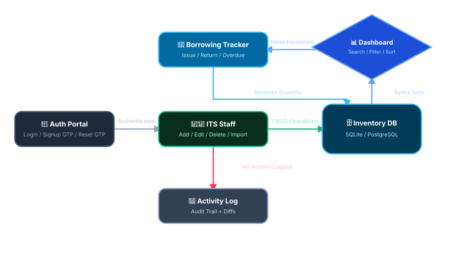
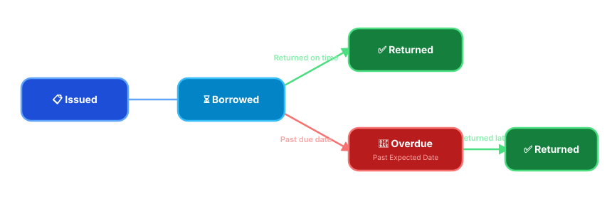

# 📦 ITS Inventory Management System

> **A web-based inventory management system built with Django for the Information and Communications Technology (ICT) department & Management Information Systems (MIS) department. Designed for internal tracking of IT assets, audit logs, email OTP user registration, self-service password recovery, and bulk Excel uploads.**

🌐 **Live Demo:** [itsinventory.pythonanywhere.com](http://itsinventory.pythonanywhere.com/)

📄 **Quick File Links:**
[](INSTRUCTIONS.md)
[](CHANGELOG.md)
[](SUPPORT.md)
[](CONTRIBUTING.md)
[](CODE_OF_CONDUCT.md)
[](SECURITY.md)
[](CITATION.cff)
[](LICENSE)
[](requirements.txt)

[](https://www.python.org/)
[](https://www.djangoproject.com/)
[](https://www.sqlite.org/)
[](https://tailwindcss.com/)
[](LICENSE)

---

## 📋 Table of Contents

- [Overview](#-overview)
- [Objectives](#-objectives)
- [Core Features](#-core-features)
- [System Architecture](#-system-architecture)
- [Tech Stack](#-tech-stack)
- [Setup & Installation](#-setup--installation)
- [URL & API Endpoints](#-url--api-endpoints)
- [Configuration & Security](#-configuration--security)
- [Project Structure](#-project-structure)
- [About](#-about)
- [License](#-license)

---

## 🔍 Overview

Managing IT equipment across multiple offices and laboratories with spreadsheets is slow, error-prone, and difficult to audit. The **ITS Inventory Management System** is a full-stack Django web application that digitizes the entire equipment lifecycle for the ITS Department.

The system provides four core workflows:

1. **Inventory Management** — Add, edit, delete, search, filter, and bulk-import IT equipment records with full CRUD operations.
2. **Borrowing & Returns** — Issue equipment to borrowers with expected return dates, track overdue items, and process returns — all with a complete paper trail.
3. **Activity Logging** — Every create, edit, delete, borrow, and return action is automatically logged with before/after snapshots for full auditability.
4. **Security & Self-Service Authentication** — Email OTP verification for account signup and self-service password recovery with case-insensitive user lookup and centered overlay alert modals.

The result: a centralized, transparent, and accountable inventory system with a premium, modern UI.

---

## 🎯 Objectives

| Goal | Description |
|---|---|
| 📁 **Centralize Records** | Replace spreadsheet-based tracking with a unified digital inventory system. |
| 🔄 **Streamline Borrowing** | Track equipment issuance, expected returns, and overdue items in real time. |
| 🧾 **Ensure Accountability** | Log every action with user attribution and before/after state diffs. |
| 🔑 **Secure Authentication** | Email & OTP verification for account registration and password recovery. |
| 📤 **Bulk Import** | Support `.xlsx` and `.csv` uploads for rapid data migration from existing spreadsheets. |
| 🎨 **Premium UI/UX** | Deliver a polished, modern interface with Tailwind CSS, glassmorphic card overlays, and micro-animations. |

---

## ✨ Core Features

### 📊 Inventory Dashboard
- **Full CRUD** — Add, view, edit, and delete inventory records via a sleek side-drawer UI.
- **Advanced Filtering** — Filter by status, location, and item type with a persistent search bar.
- **Bulk Excel Import** — Upload `.xlsx` or `.csv` files to import hundreds of records at once.
- **Status Tracking** — Visual status badges: Available, In Use, Under Repair (`repair`), Disposed, Lost.
- **Sortable DataTable** — Paginated, sortable data table powered by SimpleDatatables.

### 🔄 Borrowing Tracker
- **Equipment Issuance** — Issue items to borrowers with office/location, quantity, and expected return date.
- **Return Processing** — One-click return confirmation with automatic inventory quantity restoration.
- **Overdue Detection** — Automatic status escalation when items pass their expected return date.
- **Statistics Cards** — At-a-glance metrics: Total Issuances, Returned, Overdue.
- **Tab Filtering** — Quick-switch between All, Borrowed, Returned, and Overdue views.

### 📝 Activity Log
- **Full Audit Trail** — Every create, edit, delete, borrow, and return action is recorded.
- **Before/After Diffs** — Edit actions store field-level snapshots showing exactly what changed.
- **User Attribution** — Each log entry records which user performed the action.
- **Detail Modal** — Click any log entry for an expanded, side-by-side diff view.

### 🔐 Security & Authentication Portal
- **Single-Card Sliding Portal** — Modern dual-panel auth container with smooth horizontal slide animation between Login, Signup, and Password Recovery states.
- **Email & OTP Account Signup** — Asynchronous 6-digit OTP verification code with a 120-second lifespan sent directly to the user's email before account creation.
- **Self-Service Password Reset** — Case-insensitive email lookup (`email__iexact`), 6-digit recovery OTP verification, and secure password update flow.
- **System Overlay Modals** — Centered system overlay popup modals (`#errorModalOverlay` and `#successModalOverlay`) for alerts and confirmations.
- **Interactive UI Micro-Animations** — Animated left direction arrows (`← Nevermind, back to login`), field focus states, password visibility toggle eyes, and button spinner states.

---

## 🏗️ System Architecture

### Overall Flow


> ✏️ **Draw.io Source File:** [`docs/architecture.drawio`](docs/architecture.drawio) *(Editable in [Draw.io / app.diagrams.net](https://app.diagrams.net/))*

### Borrowing Lifecycle


> ✏️ **Draw.io Source File:** [`docs/borrowing_lifecycle.drawio`](docs/borrowing_lifecycle.drawio) *(Editable in [Draw.io / app.diagrams.net](https://app.diagrams.net/))*

---

## 🛠️ Tech Stack

| Layer / Feature | Technology & Tools | Description |
|---|---|---|
| **Web Framework** | Django 5.2 | Full-stack Python web framework with built-in ORM, routing & auth |
| **Language** | Python 3.13+ | Core backend logic, OTP engine & API request handlers |
| **Database** | SQLite 3 (default) / PostgreSQL | Relational database (SQLite for dev, PostgreSQL for production) |
| **Frontend Styling** | Tailwind CSS (CDN) | Modern utility-first CSS framework with glassmorphism styling |
| **DataTables** | SimpleDatatables 9.0.3 | Fast, standalone, paginated & sortable JS datatable engine |
| **Typography** | Google Fonts — Inter | Clean, modern variable sans-serif typography |
| **Excel Parsing** | openpyxl 3.1.5 & pandas 3.0.3 | High-performance `.xlsx` / `.csv` spreadsheet parsing for bulk imports |
| **Email Service** | Django Core Mail (SMTP) | Automated 6-digit OTP delivery for registration & password recovery |
| **Admin Portal** | `django-admin-interface` 0.32 | Custom Django Admin interface with color accents & branding |
| **Diagrams & Docs** | Draw.io (SVG / XML) | System architecture & borrowing lifecycle vector diagrams |
| **Icons** | Inline SVG (Heroicons) | Hand-crafted, responsive vector SVG iconography |

---

## 🚀 Setup & Installation

> Detailed step-by-step guide for setting up the project on **Windows** with **Python 3.13+**.

### ✅ Prerequisites

| Tool | Minimum Version | Download |
|---|---|---|
| **Python** | 3.13 | [python.org/downloads](https://www.python.org/downloads/) |
| **pip** | Latest | Bundled with Python |
| **Git** | Any | [git-scm.com/download/win](https://git-scm.com/download/win) |

---

### 1. Clone the Repository

```powershell
git clone <repository-url>
cd system
```

Replace `<repository-url>` with the actual GitHub URL of this project.

---

### 2. Set Up a Virtual Environment

```powershell
# Create the virtual environment
python -m venv env

# Activate it (PowerShell)
.\env\Scripts\Activate

# Or activate it (Command Prompt)
env\Scripts\activate.bat
```

---

### 3. Install Dependencies

```powershell
pip install -r requirements.txt
```

This installs:
- **Django 5.2** (Web framework)
- **openpyxl 3.1.5** (Excel file parsing for bulk imports)
- **pandas 3.0.3, numpy 2.5.1, Pillow 12.3.0** (Data & Image processing)
- **django-admin-interface & django-colorfield** (Admin customization)
- **asgiref, sqlparse, et_xmlfile, tzdata** (Dependencies)

---

### 4. Run Migrations

```powershell
python manage.py migrate
```

---

### 5. Create a Superuser

```powershell
python manage.py createsuperuser
```

---

### 6. Start the Development Server

```powershell
python manage.py runserver
```

The application will be available at `http://127.0.0.1:8000/`.

---

## 🔗 URL & API Endpoints

| Category | Endpoint | Method | Route Name | Description |
|---|---|---|---|---|
| **Navigation** | `/` | `GET` | `dashboard` | Main Analytics Dashboard (key stats cards, breakdown charts, recent logs) |
| **Navigation** | `/inventory/` | `GET` | `inventory-list` | Inventory management page (search, category filter, sortable datatable) |
| **Navigation** | `/borrowing/` | `GET` | `borrowing-list` | Borrowing tracker page (all, borrowed, returned, overdue filter tabs) |
| **Navigation** | `/activity-log/` | `GET` | `activity-log` | Audit log page (full system action history & field-level snapshot diffs) |
| **Auth** | `/login/` | `GET/POST` | `login` | Modern sliding auth portal (Login, Signup, Password Recovery states) |
| **Auth** | `/logout/` | `POST` | `logout` | Log out active user session and redirect to `/login/` |
| **Inventory CRUD** | `/inventory/add/` | `POST` | `inventory-create` | Create a new equipment inventory record (AJAX POST) |
| **Inventory CRUD** | `/inventory/<pk>/edit/` | `POST` | `inventory-edit` | Update an existing inventory record by primary key (AJAX POST) |
| **Inventory CRUD** | `/inventory/<pk>/delete/` | `POST` | `inventory-delete` | Delete an inventory record by primary key (AJAX POST) |
| **Inventory CRUD** | `/upload/` | `POST` | `inventory-upload` | Bulk upload equipment records via `.xlsx` or `.csv` spreadsheet (Modal POST) |
| **Borrowing API** | `/borrowing/issue/` | `POST` | `borrowing-issue` | Issue equipment to borrower & decrement available quantity (AJAX POST) |
| **Borrowing API** | `/borrowing/<pk>/return/` | `POST` | `borrowing-return` | Mark borrowed item as returned & restore inventory quantity (AJAX POST) |
| **OTP Auth API** | `/api/send-otp/` | `POST` | `send_registration_otp` | Validate username/email availability & send 6-digit signup OTP to email |
| **OTP Auth API** | `/api/verify-otp/` | `POST` | `verify_registration_otp` | Verify 6-digit signup OTP code & create new user account upon validation |
| **OTP Recovery API** | `/api/forgot-password/` | `POST` | `forgot_password_send_otp` | Query user by case-insensitive email (`email__iexact`) & send recovery OTP |
| **OTP Recovery API** | `/api/forgot-verify-otp/` | `POST` | `forgot_password_verify_otp` | Validate 6-digit password recovery OTP code |
| **OTP Recovery API** | `/api/forgot-reset-password/` | `POST` | `forgot_password_reset` | Reset user password & clear verification session tokens |
| **Admin** | `/admin/` | `GET/POST` | `admin:index` | Django built-in Admin portal & superuser management dashboard |

---

## 🛡️ Configuration & Security

| Setting / Feature | Default | Configuration / Recommendation |
|---|---|---|
| `DEBUG` | `True` | Set to `False` in production and configure `ALLOWED_HOSTS`. |
| `SECRET_KEY` | Environment / Hardcoded | Loaded via `os.getenv('SECRET_KEY', ...)`. Override via `.env` in production. |
| `ALLOWED_HOSTS` | `['127.0.0.1', 'localhost', ...]` | Restrict to authorized production domain names. |
| `DATABASES` | SQLite3 (`db.sqlite3`) | Default for dev. Use PostgreSQL for high-concurrency production workloads. |
| `CSRF Protection` | Enforced | `CsrfViewMiddleware` active with `` across 100% of POST forms. |
| `Authentication` | `@login_required` | Session authentication enforced across all inventory, borrowing, and audit views. |
| `OTP Expiration` | `120s` (2 Minutes) | 6-digit verification codes expire automatically after 120 seconds. |
| `Email Lookup` | `email__iexact` | Case-insensitive query prevents email casing mismatch during recovery. |
| `SMTP Credentials` | `os.getenv(...)` | Loaded dynamically via `EMAIL_HOST_USER` and `EMAIL_HOST_PASSWORD` environment variables. |

---

## 📁 Project Structure

```
📦 system/
├── 📂 .github/                    🐙 GitHub templates & issue workflows
│   ├── 📂 ISSUE_TEMPLATE/         📋 Interactive GitHub issue templates (Bug Report, Feature Request)
│   │   ├── 🐛 bug_report.md       # Bug report issue template
│   │   └── 💡 feature_request.md  # Feature request issue template
│   └── 📄 PULL_REQUEST_TEMPLATE.md# Pre-populated PR review template
├── 📂 docs/                       📐 System Architecture & Draw.io diagrams & templates
│   ├── 📂 assets/                 📸 UI Screenshots & Visual Snapshots
│   │   ├── 📸 dashboard_snapshot.png
│   │   ├── 📸 borrowing_snapshot.png
│   │   ├── 📸 activity_snapshot.png
│   │   └── 📸 login_snapshot.png
│   ├── 📂 excel-templates/        📊 Bulk import Excel sample templates
│   │   ├── 📊 ITS_INVENTORY_10000.xlsx
│   │   └── 📊 ITS_INVENTORY_2000_FIXED.xlsx
│   ├── 📐 architecture.drawio.svg  # Overall system flow SVG diagram
│   ├── 📐 architecture.drawio      # Editable Draw.io XML source
│   ├── 📐 borrowing_lifecycle.drawio.svg # Borrowing lifecycle SVG diagram
│   └── 📐 borrowing_lifecycle.drawio     # Editable Draw.io XML source
├── 📂 env/                        🐍 Python virtual environment (local / ignored)
├── 📂 its_inventory/              ⚙️ Django project: settings, urls, wsgi, asgi
│   ├── 🐍 settings.py             # Project configuration (DB, middleware, email, etc.)
│   ├── 🐍 urls.py                 # Root URL routing & API mapping
│   ├── 🐍 wsgi.py                 # WSGI entry point
│   └── 🐍 asgi.py                 # ASGI entry point
├── 📂 inventory/                  ⚙️ Main app: models, views, forms, admin, tests
│   ├── 🐍 models.py               # Inventory, IssuanceLog, AuditLog models
│   ├── 🐍 views.py                # All CRUD, borrowing, audit log, and OTP/Auth API logic
│   ├── 🐍 forms.py                # Django ModelForms for inventory
│   ├── 🐍 admin.py                # Django Admin registration
│   └── 🐍 tests.py                # Automated Django unit test suite
├── 📂 templates/                  🎨 HTML templates
│   ├── 📂 admin/                  ⚙️ Custom Django Admin templates
│   │   └── 🌐 base_site.html      # Django admin site header & portal branding
│   ├── 🌐 activity_log.html       # Audit log viewer
│   ├── 🌐 borrowing.html          # Borrowing tracker
│   ├── 🌐 dashboard.html          # Main analytics dashboard
│   ├── 🌐 inventory.html          # Main inventory records list & modals
│   └── 🌐 login.html              # Login, Signup, Reset Password & Overlay Modals
├── 📂 static/                     🎨 Static assets
│   ├── 📂 css/                    🎨 Stylesheets
│   │   ├── 🎨 inventory.css       # Main inventory & sidebar styles
│   │   ├── 🎨 borrowing.css       # Borrowing tracker styles
│   │   └── 🎨 login.css           # Auth portal & overlay modal styles
│   └── 📂 js/                     📜 Frontend JavaScript scripts
│       ├── 📜 inventory.js        # Inventory CRUD & Datatable handlers
│       ├── 📜 borrowing.js        # Borrowing modal & search handlers
│       ├── 📜 dashboard.js        # Analytics charts & stats handlers
│       ├── 📜 login.js            # Auth slider, OTP & modal handlers
│       └── 📜 tailwind-config.js  # Tailwind CSS custom theme configuration
├── 🗄️ db.sqlite3                  # SQLite database (auto-generated)
├── 🐍 manage.py                   # Django management CLI
├── ⚙️ requirements.txt            # Python dependencies
├── 📄 INSTRUCTIONS.md             # Detailed setup & security documentation
├── 📄 CHANGELOG.md                # System version release history
├── 📄 SUPPORT.md                  # Support resources & institutional contacts
├── 📄 CONTRIBUTING.md           # Developer contribution guidelines
├── 📄 CODE_OF_CONDUCT.md        # Community code of conduct guidelines
├── 📄 SECURITY.md                 # Security policy & vulnerability reporting guide
├── 📄 CITATION.cff                # Academic software citation metadata
├── 📄 LICENSE                     # MIT License
└── 📄 README.md                   # System documentation
```

---

## 🧑‍💻 About

### The Project

The **ITS Inventory Management System** was originally developed as an internal tool for the **Information and Communications Technology (ICT) Department** and has been formally turned over to the **Management Information Systems (MIS) Department** for continued operation and maintenance. It replaces manual spreadsheet-based processes with a centralized, auditable, web-based platform.

### Turned Over To

This system was originally built for the ICT Department and has been handed over to the **Management Information Systems (MIS) Department** — ensuring continued, transparent, and fully auditable equipment management.

---

## 📄 License

This project is licensed under the **MIT License** — see the [LICENSE](LICENSE) file for full details.

```text
MIT License

Copyright (c) 2026 John Tyrone Pagunsan Coronel (TheUnshackled1) — https://github.com/TheUnshackled1

Permission is hereby granted, free of charge, to any person obtaining a copy
of this software and associated documentation files (the "Software"), to deal
in the Software without restriction, including without limitation the rights
to use, copy, modify, merge, publish, distribute, sublicense, and/or sell
copies of the Software, and to permit persons to whom the Software is
furnished to do so, subject to the following conditions:

The above copyright notice and this permission notice shall be included in all
copies or substantial portions of the Software.

THE SOFTWARE IS PROVIDED "AS IS", WITHOUT WARRANTY OF ANY KIND, EXPRESS OR
IMPLIED, INCLUDING BUT NOT LIMITED TO THE WARRANTIES OF MERCHANTABILITY,
FITNESS FOR A PARTICULAR PURPOSE AND NONINFRINGEMENT.
```
