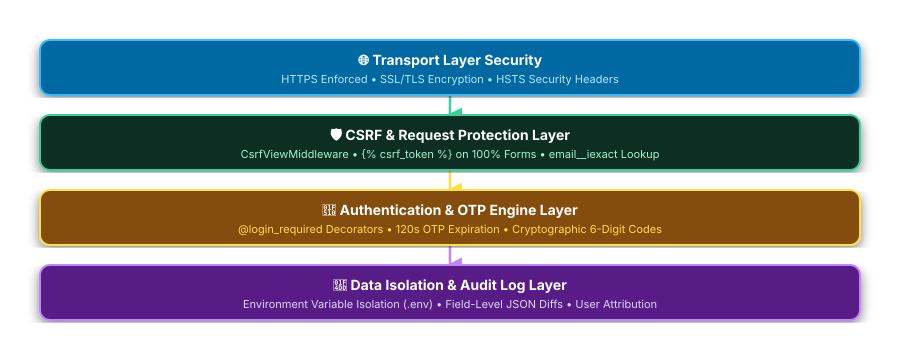

# 🛡️ Security Policy

> Security policy and vulnerability reporting guidelines for the **ITS Inventory Management System**.

---

## 📋 Supported Versions

The table below details which versions of the system currently receive security updates and bug fixes:

| Version | Supported | Minimum Python | Minimum Django |
|---|---|---|---|
| `1.0.x` | ✅ Yes | `3.13+` | `5.2+` |
| `< 1.0` | ❌ No | — | — |

---

## 🔒 Reporting a Vulnerability

The security of the **ITS Inventory Management System** and its stored equipment data is a top priority.

If you discover a security vulnerability or suspect a security flaw within the application:

1. **Do NOT open a public GitHub issue** or publicly disclose the vulnerability.
2. **Email the Security Team privately**: Send a detailed report to the system administrators at `jtcoronel.chmsu@gmail.com` or contact the **Management Information Systems (MIS) Department**.
3. **Include Key Details**:
   - Type of issue (e.g., CSRF, Authentication Bypass, XSS, Information Disclosure).
   - Step-by-step instructions or proof-of-concept to reproduce the issue.
   - Affected views, endpoints, or templates.

### ⏱️ Response Timeline

- **Acknowledgment**: Within 24 hours of receipt.
- **Assessment & Triage**: Within 48 hours.
- **Patch & Fix Release**: Critical fixes released within 7 days.

---

## 🛡️ Built-in Security Measures

> ✏️ **Draw.io Source File:** [`docs/security_architecture.drawio`](docs/security_architecture.drawio) *(Editable in [Draw.io / app.diagrams.net](https://app.diagrams.net/))*

The system enforces several security controls out of the box:

- **CSRF Protection**: `django.middleware.csrf.CsrfViewMiddleware` active with `` tags across 100% of POST forms.
- **Authentication & Access Control**: Session-based auth with `@login_required` decorators protecting all inventory CRUD, borrowing, and audit views.
- **Email OTP Engine**: Cryptographically secure 6-digit verification codes with a strict **120-second lifespan** for registration and recovery.
- **Case-Insensitive Account Lookup**: Password recovery queries user records safely using `email__iexact`.
- **Field-Level Audit Trail**: Every create, edit, delete, borrow, and return action is logged with before/after state diffs and user attribution for full auditability.
- **Environment Isolation**: `SECRET_KEY`, `EMAIL_HOST_USER`, and `EMAIL_HOST_PASSWORD` load dynamically via `os.getenv(...)` with fallback safety.

---

## 📜 Disclosure Policy

We follow a **Responsible Disclosure** process. Once a reported vulnerability is fixed and verified, security advisories will be published alongside updated patch releases.
