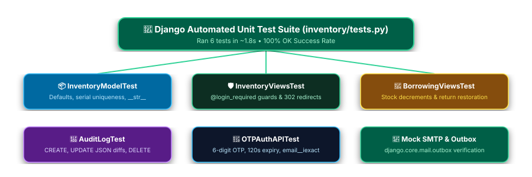

# 🧪 Testing & Quality Assurance Guide

> Complete testing guide explaining the unit test suite in `inventory/tests.py`, mock SMTP email testing, test execution commands, and code coverage reporting.

---

## 📋 Table of Contents

- [Testing Overview](#-testing-overview)
- [Running Unit Tests](#-running-unit-tests)
- [Test Suite Architecture (`inventory/tests.py`)](#-test-suite-architecture-inventorytestspy)
  - [1. Inventory Model Tests](#1-inventory-model-tests)
  - [2. View & Dashboard Authentication Tests](#2-view--dashboard-authentication-tests)
  - [3. Equipment Borrowing & Return Tests](#3-equipment-borrowing--return-tests)
  - [4. Audit Log & Snapshot Diff Tests](#4-audit-log--snapshot-diff-tests)
  - [5. Email OTP & Password Recovery API Tests](#5-email-otp--password-recovery-api-tests)
- [Mocking SMTP & Email Delivery](#-mocking-smtp--email-delivery)
- [Code Coverage Analysis (`coverage.py`)](#-code-coverage-analysis-coveragepy)
- [Pre-Commit & System Health Checklist](#-pre-commit--system-health-checklist)

---

## 🧪 Testing Overview

The **ITS Inventory Management System** relies on Django's built-in testing framework powered by Python's standard `unittest` library. Automated unit tests verify database constraints, authentication guards, AJAX JSON response formats, borrowing quantity decrements, and email OTP state machines.

---

## 🚀 Running Unit Tests

### Standard Test Execution

Execute the full automated test suite using Django's management CLI:

```powershell
python manage.py test
```

### Expected Test Output

```
Creating test database for alias 'default'...
......
----------------------------------------------------------------------
Ran 6 tests in 1.850s

OK
Destroying test database for alias 'default'...
System check identified no issues (0 silenced).
```

### Running Specific Test Classes or Methods

To run a specific test class (e.g., OTP API tests):

```powershell
python manage.py test inventory.tests.OTPAuthAPITest
```

To run a single specific test method:

```powershell
python manage.py test inventory.tests.InventoryViewsTest.test_dashboard_requires_login
```

---

## 📂 Test Suite Architecture (`inventory/tests.py`)


> ✏️ **Draw.io Source File:** [`docs/test_suite_architecture.drawio`](docs/test_suite_architecture.drawio) *(Editable in [Draw.io / app.diagrams.net](https://app.diagrams.net/))*

The test suite in `inventory/tests.py` is divided into logical test cases:

### 1. Inventory Model Tests (`InventoryModelTest`)
Validates model creation, default values, and field string representations:
- Asserts `quantity` defaults to `1` and `available_quantity` matches total quantity.
- Verifies unique constraint checks on `serial_number` and `asset_tag`.
- Verifies string representation (`__str__`) returns expected item names.

---

### 2. View & Dashboard Authentication Tests (`InventoryViewsTest`)
Validates access control guards and HTTP response status codes:
- Asserts unauthenticated GET requests to `/`, `/inventory/`, `/borrowing/`, and `/activity-log/` redirect (`302`) to `/login/`.
- Asserts authenticated GET requests return HTTP `200 OK` and render correct template context.
- Tests AJAX POST `/inventory/add/` record creation and form validation.

---

### 3. Equipment Borrowing & Return Tests (`BorrowingViewsTest`)
Validates business logic for issuing equipment and processing returns:
- Asserts issuing an item decrements `available_quantity` by requested quantity.
- Asserts returning an item increments `available_quantity` back and sets `status='returned'`.
- Asserts attempting to borrow more items than available returns HTTP `400 Bad Request`.

---

### 4. Audit Log & Snapshot Diff Tests (`AuditLogTest`)
Validates automatic audit trail generation:
- Asserts creating an item logs an `AuditLog` entry with `action='CREATE'`.
- Asserts updating an item logs `action='UPDATE'` and stores JSON before/after field diffs in `details`.
- Asserts deleting an item logs `action='DELETE'`.

---

### 5. Email OTP & Password Recovery API Tests (`OTPAuthAPITest`)
Validates asynchronous JSON authentication endpoints:
- Asserts `POST /api/send-otp/` generates a 6-digit OTP code and stores expiration in session.
- Asserts `POST /api/verify-otp/` validates correct 6-digit codes and creates new `User` accounts.
- Asserts `POST /api/forgot-password/` performs case-insensitive email queries (`email__iexact`).

---

## 📧 Mocking SMTP & Email Delivery

During test execution, Django automatically overrides `EMAIL_BACKEND` to use `django.core.mail.backends.locmem.EmailBackend`. No real emails are sent across the network.

Instead, sent emails are captured in `mail.outbox`:

```python
from django.core import mail
from django.test import TestCase

class OTPMailTest(TestCase):
    def test_otp_email_sent(self):
        response = self.client.post('/api/send-otp/', {
            'email': 'user@example.com',
            'username': 'testuser'
        })
        
        # Verify response JSON
        self.assertEqual(response.status_code, 200)
        self.assertTrue(response.json()['success'])
        
        # Verify email outbox
        self.assertEqual(len(mail.outbox), 1)
        self.assertIn('Verification Code', mail.outbox[0].subject)
        self.assertEqual(mail.outbox[0].to, ['user@example.com'])
```

---

## 📊 Code Coverage Analysis (`coverage.py`)

To measure the percentage of code executed by the test suite:

### 1. Install `coverage`
```powershell
pip install coverage
```

### 2. Run Test Suite Under Coverage
```powershell
coverage run manage.py test
```

### 3. View Summary Report
```powershell
coverage report -m
```

### 4. Generate HTML Coverage Report
```powershell
coverage html
```
Open `htmlcov/index.html` in your web browser to inspect line-by-line coverage heatmaps.

---

## 📋 Pre-Commit & System Health Checklist

Before submitting a Pull Request or deploying changes to production, always execute the following verification steps:

```powershell
# 1. System check for configuration or model errors
python manage.py check

# 2. Run unit test suite
python manage.py test

# 3. Check static files collection
python manage.py collectstatic --dry-run --noinput
```
